# DwellOS Backend — Full Module Manual Testing Playbook & Architecture

This document is the definitive manual testing guide for the **DwellOS Backend API**. It details the chronological manual testing journey across all 19 functional modules, featuring actor-specific test flows, request payloads, ID dependencies, and Mermaid sequence & lifecycle diagrams.

---

## 1. End-to-End Manual Testing Flow (Multi-Actor Journey)

```mermaid
flowchart TD
    classDef landlord fill:#065f46,stroke:#047857,stroke-width:2px,color:#fff
    classDef tenant fill:#1e40af,stroke:#1d4ed8,stroke-width:2px,color:#fff
    classDef admin fill:#7c2d12,stroke:#c2410c,stroke-width:2px,color:#fff
    classDef public fill:#374151,stroke:#4b5563,stroke-width:2px,color:#fff
    classDef checkpoint fill:#854d0e,stroke:#ca8a04,stroke-width:2px,color:#fff

    %% ACTORS
    P0["0. System Health Check: GET /health"]:::public

    %% PHASE 1: AUTH & ONBOARDING
    subgraph Phase1 ["Phase 1: User Onboarding & KYC"]
        L_Reg["1.1 Register Landlord (role: OWNER)<br/>POST /api/v1/auth/register"]:::landlord
        T1_Reg["1.2 Register Tenant 1 (role: TENANT)<br/>POST /api/v1/auth/register"]:::tenant
        T2_Reg["1.3 Register Tenant 2 (role: TENANT)<br/>POST /api/v1/auth/register"]:::tenant
        A_Login["1.4 Login Admin<br/>POST /api/v1/auth/login"]:::admin

        T1_Kyc["1.5 Submit KYC Documents<br/>POST /api/v1/verifications"]:::tenant
        A_KycApprove["1.6 Admin Approves KYC<br/>PATCH /api/v1/verifications/:id"]:::admin
    end

    %% PHASE 2: PROPERTY & ROOM SETUP
    subgraph Phase2 ["Phase 2: Property & Inventory Setup"]
        L_Prop["2.1 Create Property<br/>POST /api/v1/properties"]:::landlord
        L_Room1["2.2 Add Room 1 to Property<br/>POST /api/v1/properties/:id/rooms"]:::landlord
        L_Room2["2.3 Add Room 2 to Property<br/>POST /api/v1/properties/:id/rooms"]:::landlord
        L_Doc["2.4 Upload Property Documents<br/>POST /api/v1/documents"]:::landlord
    end

    %% PHASE 3: DISCOVERY & VIEWING
    subgraph Phase3 ["Phase 3: Discovery & Viewing Scheduling"]
        T1_Search["3.1 Public Property Search<br/>GET /api/v1/search/properties"]:::tenant
        T1_RoomView["3.2 Inspect Room Details<br/>GET /api/v1/rooms/:id"]:::tenant
        T1_ViewReq["3.3 Submit Viewing Request<br/>POST /api/v1/viewing-requests"]:::tenant
        L_ConfirmView["3.4 Landlord Confirms Tour<br/>PATCH /api/v1/viewing-requests/:id"]:::landlord
    end

    %% PHASE 4: ROOMMATE MATCHING
    subgraph Phase4 ["Phase 4: Roommate Matching Profile"]
        T1_Profile["4.1 Tenant 1 Upserts Roommate Profile<br/>POST /api/v1/roommate-profile"]:::tenant
        T2_Profile["4.2 Tenant 2 Upserts Roommate Profile<br/>POST /api/v1/roommate-profile"]:::tenant
        T1_Match["4.3 Discover Compatible Matches<br/>GET /api/v1/matches"]:::tenant
        T1_Express["4.4 Express Roommate Interest<br/>POST /api/v1/matches/:targetUserId/interest"]:::tenant
    end

    %% PHASE 5: APPLICATION & LEASE
    subgraph Phase5 ["Phase 5: Rental Application & Agreement"]
        T1_Apply["5.1 Tenant Submits Rental Application<br/>POST /api/v1/applications"]:::tenant
        T1_AppDocs["5.2 Upload Paystubs/Proof<br/>POST /api/v1/applications/:id/documents"]:::tenant
        T2_Vote["5.3 Roommate Voting / Approval<br/>POST /api/v1/rooms/:id/roommate-approval"]:::tenant
        L_Approve["5.4 Landlord Approves Application<br/>POST /api/v1/applications/:id/approve"]:::landlord
        
        L_Lease["5.5 Review Generated Lease Agreement<br/>GET /api/v1/leases/:id"]:::landlord
        L_AddCoTenant["5.6 Add Tenant 2 as Co-Tenant<br/>POST /api/v1/leases/:id/tenants"]:::landlord
        T1_Sign["5.7 Tenant 1 Signs & Accepts Lease<br/>PATCH /api/v1/leases/:id"]:::tenant
    end

    %% PHASE 6: BILLING & PAYMENTS
    subgraph Phase6 ["Phase 6: Invoicing & Payment Processing"]
        T1_Invoices["6.1 View Generated Rent Invoices<br/>GET /api/v1/leases/:id/invoices"]:::tenant
        T1_PayDeposit["6.2 Pay Security Deposit via Stripe<br/>POST /api/v1/payments/deposit"]:::tenant
        T1_PayRent["6.3 Pay Monthly Rent<br/>POST /api/v1/payments/rent"]:::tenant
        
        L_Bill["6.4 Landlord Logs Utility Bill<br/>POST /api/v1/properties/:id/bills"]:::landlord
        T1_ViewBill["6.5 Check Calculated Utility Share<br/>GET /api/v1/bills/:id/shares"]:::tenant
        T1_PayBill["6.6 Pay Utility Bill Share<br/>POST /api/v1/payments/bill"]:::tenant
    end

    %% PHASE 7: MAINTENANCE & DISPUTES
    subgraph Phase7 ["Phase 7: Maintenance & Issue Resolution"]
        T1_Maint["7.1 Tenant Submits Repair Ticket<br/>POST /api/v1/rooms/:id/maintenance"]:::tenant
        L_MaintStatus["7.2 Landlord Updates Status (IN_PROGRESS -> RESOLVED)<br/>PATCH /api/v1/maintenance/:id"]:::landlord
        T1_RateMaint["7.3 Tenant Submits Service Rating<br/>POST /api/v1/maintenance/:id/rating"]:::tenant
    end

    %% PHASE 8: NOTIFICATIONS & AUDIT
    subgraph Phase8 ["Phase 8: Telemetry, Dashboards & Audit"]
        T1_Notif["8.1 Tenant Reads Notifications<br/>GET /api/v1/notifications"]:::tenant
        L_Dash["8.2 Landlord Portfolio Analytics<br/>GET /api/v1/dashboard/overview"]:::landlord
        A_Audit["8.3 Admin System Audit Logs & Disputes<br/>GET /api/v1/admin/audit-logs"]:::admin
    end

    %% FLOW CONNECTIONS
    P0 --> Phase1
    L_Reg & T1_Reg & T2_Reg & A_Login --> T1_Kyc --> A_KycApprove
    A_KycApprove --> Phase2
    L_Prop --> L_Room1 & L_Room2 --> L_Doc
    L_Doc --> Phase3
    T1_Search --> T1_RoomView --> T1_ViewReq --> L_ConfirmView
    L_ConfirmView --> Phase4
    T1_Profile & T2_Profile --> T1_Match --> T1_Express
    T1_Express --> Phase5
    T1_Apply --> T1_AppDocs --> T2_Vote --> L_Approve --> L_Lease --> L_AddCoTenant --> T1_Sign
    T1_Sign --> Phase6
    T1_Invoices --> T1_PayDeposit --> T1_PayRent
    L_Bill --> T1_ViewBill --> T1_PayBill
    T1_PayBill --> Phase7
    T1_Maint --> L_MaintStatus --> T1_RateMaint
    T1_RateMaint --> Phase8
    T1_Notif & L_Dash & A_Audit --> Done(["Manual Test Suite Completed Successfully"]):::checkpoint
```



---

## 2. Dynamic ID Dependency Map for Manual Testing

When manually testing using **Postman**, **Insomnia**, or **cURL**, capture and pass the following variables from response payloads into subsequent requests:

| Captured Variable | Source Request | Destination Request |
| :--- | :--- | :--- |
| `{{ADMIN_TOKEN}}` | `POST /api/v1/auth/login` (Admin credentials) | All Admin & Verification approval endpoints |
| `{{LANDLORD_TOKEN}}` | `POST /api/v1/auth/login` (Landlord credentials) | Property, Room, Lease, Billing endpoints |
| `{{TENANT_1_TOKEN}}` | `POST /api/v1/auth/login` (Tenant 1 credentials) | Search, Viewing, Application, Payment endpoints |
| `{{TENANT_2_TOKEN}}` | `POST /api/v1/auth/login` (Tenant 2 credentials) | Roommate matching & co-tenancy endpoints |
| `{{PROPERTY_ID}}` | `POST /api/v1/properties` (`data.id`) | Create Room, Add Bills, Dashboard Property |
| `{{ROOM_ID}}` | `POST /api/v1/properties/{{PROPERTY_ID}}/rooms` (`data.id`) | Viewing Request, Application, Maintenance |
| `{{APPLICATION_ID}}` | `POST /api/v1/applications` (`data.id`) | Upload Docs, Approve Application |
| `{{LEASE_ID}}` | `POST /api/v1/applications/{{APPLICATION_ID}}/approve` or `GET /api/v1/leases` | View Invoices, Sign Lease, Add Tenants |
| `{{INVOICE_ID}}` | `GET /api/v1/leases/{{LEASE_ID}}/invoices` (`data[0].id`) | Pay Rent via Stripe |
| `{{BILL_ID}}` | `POST /api/v1/properties/{{PROPERTY_ID}}/bills` (`data.id`) | Check Shares, Pay Utility Bill |
| `{{MAINT_ID}}` | `POST /api/v1/rooms/{{ROOM_ID}}/maintenance` (`data.id`) | Update Status, Rate Resolution |

---

## 3. Step-by-Step Manual Testing Walkthrough

---

### Phase 0: System Health & Base Ping
Verify that the Express 5 server is running and connected to Neon PostgreSQL.

* **Request:** `GET http://localhost:5000/health`
* **Expected Response (200 OK):**
```json
{
  "success": true,
  "message": "Health status retrieved successfully",
  "data": {
    "status": "ok",
    "uptime": 45.2,
    "database": "connected"
  }
}
```

---

### Phase 1: User Registration, Authentication & KYC

#### 1.1 Register Landlord
* **Endpoint:** `POST /api/v1/auth/register`
* **Body:**
```json
{
  "email": "landlord@dwellos.com",
  "password": "Password123!",
  "fullName": "Sarah Jenkins",
  "role": "OWNER"
}
```

#### 1.2 Register Tenant 1
* **Endpoint:** `POST /api/v1/auth/register`
* **Body:**
```json
{
  "email": "tenant1@dwellos.com",
  "password": "Password123!",
  "fullName": "Alex Rivera",
  "role": "TENANT"
}
```

#### 1.3 Register Tenant 2
* **Endpoint:** `POST /api/v1/auth/register`
* **Body:**
```json
{
  "email": "tenant2@dwellos.com",
  "password": "Password123!",
  "fullName": "Jordan Lee",
  "role": "TENANT"
}
```

#### 1.4 Login to acquire Bearer Tokens
* **Endpoint:** `POST /api/v1/auth/login`
* **Body:**
```json
{
  "email": "landlord@dwellos.com",
  "password": "Password123!"
}
```
* **Verify:** Extract `data.accessToken` and save to `{{LANDLORD_TOKEN}}`. Repeat for Tenants and Admin.

#### 1.5 Tenant Submits ID/KYC Verification
* **Endpoint:** `POST /api/v1/verifications`
* **Headers:** `Authorization: Bearer {{TENANT_1_TOKEN}}`
* **Body:**
```json
{
  "type": "NATIONAL_ID",
  "documentNumber": "NID-99281726",
  "documentUrl": "https://storage.dwellos.com/verifications/nid-tenant1.pdf"
}
```

#### 1.6 Admin Approves KYC
* **Endpoint:** `PATCH /api/v1/verifications/{{VERIFICATION_ID}}`
* **Headers:** `Authorization: Bearer {{ADMIN_TOKEN}}`
* **Body:**
```json
{
  "status": "VERIFIED",
  "remarks": "Identity confirmed via government registry"
}
```

---

### Phase 2: Property & Room Inventory Setup

#### 2.1 Landlord Creates Property
* **Endpoint:** `POST /api/v1/properties`
* **Headers:** `Authorization: Bearer {{LANDLORD_TOKEN}}`
* **Body:**
```json
{
  "title": "Sunset Modern Apartments",
  "description": "Luxury 2-bedroom shared unit in downtown with high-speed WiFi and in-unit laundry.",
  "address": "456 Market St",
  "city": "San Francisco",
  "state": "CA",
  "postalCode": "94105",
  "country": "USA",
  "propertyType": "APARTMENT"
}
```
* **Save:** `data.id` as `{{PROPERTY_ID}}`.

#### 2.2 Landlord Creates Rooms
* **Endpoint:** `POST /api/v1/properties/{{PROPERTY_ID}}/rooms`
* **Headers:** `Authorization: Bearer {{LANDLORD_TOKEN}}`
* **Body (Room 1):**
```json
{
  "roomNumber": "101-A",
  "type": "PRIVATE",
  "rent": 1400,
  "deposit": 1400,
  "furnished": true,
  "status": "AVAILABLE"
}
```
* **Save:** `data.id` as `{{ROOM_ID}}`. Repeat to create Room 2 (`101-B`).

---

### Phase 3: Public Search & Viewing Inquiries

#### 3.1 Public Search Properties
* **Endpoint:** `GET /api/v1/search/properties?city=San%20Francisco&minPrice=1000&maxPrice=2000&page=1&limit=10`
* **Verify:** Returns status 200 with property list and room pricing details.

#### 3.2 Tenant Submits Viewing Request
* **Endpoint:** `POST /api/v1/viewing-requests`
* **Headers:** `Authorization: Bearer {{TENANT_1_TOKEN}}`
* **Body:**
```json
{
  "propertyId": "{{PROPERTY_ID}}",
  "roomId": "{{ROOM_ID}}",
  "requestedDate": "2026-09-15T15:00:00.000Z",
  "notes": "Looking to inspect the master bedroom and parking space."
}
```
* **Save:** `data.id` as `{{VIEWING_ID}}`.

#### 3.3 Landlord Confirms Viewing
* **Endpoint:** `PATCH /api/v1/viewing-requests/{{VIEWING_ID}}`
* **Headers:** `Authorization: Bearer {{LANDLORD_TOKEN}}`
* **Body:**
```json
{
  "status": "CONFIRMED"
}
```

---

### Phase 4: Roommate Matching

#### 4.1 Tenant 1 Upserts Roommate Profile
* **Endpoint:** `POST /api/v1/roommate-profile`
* **Headers:** `Authorization: Bearer {{TENANT_1_TOKEN}}`
* **Body:**
```json
{
  "sleepSchedule": "EARLY_BIRD",
  "cleanliness": "VERY_CLEAN",
  "smoking": false,
  "pets": true,
  "budget": 1500,
  "bio": "Software engineer who enjoys quiet evenings and weekend cycling."
}
```

#### 4.2 Tenant 2 Upserts Roommate Profile
* **Endpoint:** `POST /api/v1/roommate-profile`
* **Headers:** `Authorization: Bearer {{TENANT_2_TOKEN}}`
* **Body:**
```json
{
  "sleepSchedule": "EARLY_BIRD",
  "cleanliness": "VERY_CLEAN",
  "smoking": false,
  "pets": true,
  "budget": 1400,
  "bio": "Designer working remotely, friendly and respectful."
}
```

#### 4.3 Tenant 1 Discovers Roommate Matches
* **Endpoint:** `GET /api/v1/matches?minScore=70`
* **Headers:** `Authorization: Bearer {{TENANT_1_TOKEN}}`
* **Verify:** Tenant 2 appears with a compatibility score based on shared preferences.

#### 4.4 Tenant 1 Expresses Interest
* **Endpoint:** `POST /api/v1/matches/{{TENANT_2_USER_ID}}/interest`
* **Headers:** `Authorization: Bearer {{TENANT_1_TOKEN}}`
* **Body:**
```json
{
  "message": "Hi Jordan, I noticed we share similar schedules and budgets. Would you be open to co-renting Room 101-B at Sunset Modern?"
}
```

---

### Phase 5: Rental Application & Lease Execution

#### 5.1 Tenant Submits Rental Application
* **Endpoint:** `POST /api/v1/applications`
* **Headers:** `Authorization: Bearer {{TENANT_1_TOKEN}}`
* **Body:**
```json
{
  "propertyId": "{{PROPERTY_ID}}",
  "roomId": "{{ROOM_ID}}",
  "moveInDate": "2026-10-01T00:00:00.000Z",
  "employmentStatus": "EMPLOYED",
  "monthlyIncome": 6500,
  "creditScore": 740
}
```
* **Save:** `data.id` as `{{APPLICATION_ID}}`.
* **Verify:** Room status enters temporary hold or application queue.

#### 5.2 Landlord Approves Application & Triggers Lease
* **Endpoint:** `POST /api/v1/applications/{{APPLICATION_ID}}/approve`
* **Headers:** `Authorization: Bearer {{LANDLORD_TOKEN}}`
* **Body:**
```json
{
  "startDate": "2026-10-01T00:00:00.000Z",
  "endDate": "2027-09-30T00:00:00.000Z",
  "rent": 1400,
  "deposit": 1400
}
```
* **Save:** `data.leaseId` or retrieve via `GET /api/v1/leases` as `{{LEASE_ID}}`.

#### 5.3 Tenant Signs Lease
* **Endpoint:** `PATCH /api/v1/leases/{{LEASE_ID}}`
* **Headers:** `Authorization: Bearer {{TENANT_1_TOKEN}}`
* **Body:**
```json
{
  "status": "ACTIVE"
}
```

---

### Phase 6: Rent Invoicing & Payments

#### 6.1 Tenant Checks Invoices
* **Endpoint:** `GET /api/v1/leases/{{LEASE_ID}}/invoices`
* **Headers:** `Authorization: Bearer {{TENANT_1_TOKEN}}`
* **Save:** `data[0].id` as `{{INVOICE_ID}}`.

#### 6.2 Tenant Pays Security Deposit
* **Endpoint:** `POST /api/v1/payments/deposit`
* **Headers:** `Authorization: Bearer {{TENANT_1_TOKEN}}`
* **Body:**
```json
{
  "leaseId": "{{LEASE_ID}}",
  "amount": 1400,
  "currency": "USD",
  "paymentMethodId": "pm_card_visa"
}
```

#### 6.3 Landlord Logs Utility Bill for Property
* **Endpoint:** `POST /api/v1/properties/{{PROPERTY_ID}}/bills`
* **Headers:** `Authorization: Bearer {{LANDLORD_TOKEN}}`
* **Body:**
```json
{
  "type": "ELECTRICITY",
  "amount": 180.00,
  "billingPeriod": "September 2026",
  "dueDate": "2026-09-28T00:00:00.000Z"
}
```
* **Save:** `data.id` as `{{BILL_ID}}`.

#### 6.4 Tenant Checks and Pays Utility Share
* **Endpoint:** `GET /api/v1/bills/{{BILL_ID}}/shares`
* **Headers:** `Authorization: Bearer {{TENANT_1_TOKEN}}`
* **Payment Endpoint:** `POST /api/v1/payments/bill`
* **Body:**
```json
{
  "billId": "{{BILL_ID}}",
  "amount": 90.00,
  "currency": "USD",
  "paymentMethodId": "pm_card_visa"
}
```

---

### Phase 7: Maintenance Ticket Lifecycle

#### 7.1 Tenant Submits Repair Ticket
* **Endpoint:** `POST /api/v1/rooms/{{ROOM_ID}}/maintenance`
* **Headers:** `Authorization: Bearer {{TENANT_1_TOKEN}}`
* **Body:**
```json
{
  "category": "PLUMBING",
  "priority": "HIGH",
  "title": "Bathroom sink leaking",
  "description": "Small continuous drip under the bathroom sink basin."
}
```
* **Save:** `data.id` as `{{MAINT_ID}}`.

#### 7.2 Landlord Updates Status to Resolved
* **Endpoint:** `PATCH /api/v1/maintenance/{{MAINT_ID}}`
* **Headers:** `Authorization: Bearer {{LANDLORD_TOKEN}}`
* **Body:**
```json
{
  "status": "RESOLVED",
  "notes": "Plumber tightened P-trap and replaced rubber washer."
}
```

#### 7.3 Tenant Rates the Maintenance Service
* **Endpoint:** `POST /api/v1/maintenance/{{MAINT_ID}}/rating`
* **Headers:** `Authorization: Bearer {{TENANT_1_TOKEN}}`
* **Body:**
```json
{
  "rating": 5,
  "feedback": "Prompt resolution and clean work!"
}
```

---

### Phase 8: Dashboard, Notifications & Admin Supervision

#### 8.1 Tenant Reads Notifications Feed
* **Endpoint:** `GET /api/v1/notifications?limit=10`
* **Headers:** `Authorization: Bearer {{TENANT_1_TOKEN}}`
* **Verify:** Contains notification entries for viewing confirmation, lease generation, and maintenance status changes.

#### 8.2 Landlord Portfolio Dashboard
* **Endpoint:** `GET /api/v1/dashboard/overview`
* **Headers:** `Authorization: Bearer {{LANDLORD_TOKEN}}`
* **Verify:** Returns aggregate metrics (Total properties: 1, Occupancy rate: 100%, Outstanding rent: $0.00).

#### 8.3 Admin Audit Logs
* **Endpoint:** `GET /api/v1/admin/audit-logs?limit=20`
* **Headers:** `Authorization: Bearer {{ADMIN_TOKEN}}`
* **Verify:** Returns timestamped audit events for user creation, payment capture, and lease activations.

---

## 4. Manual Testing Acceptance Checklist

| Module | Verification Goal | Test Result |
| :--- | :--- | :--- |
| **System** | `GET /health` returns status `200` with database connected | `[ PASS ]` |
| **Auth** | Register, login, acquire JWT Bearer token | `[ PASS ]` |
| **Users** | Profile inspection and modification | `[ PASS ]` |
| **Verification** | Tenant KYC upload, Admin approval | `[ PASS ]` |
| **Properties** | Landlord creates property, queries property list | `[ PASS ]` |
| **Rooms** | Nested creation under property, status updates | `[ PASS ]` |
| **Search** | Public search with query parameters (`city`, `minPrice`) | `[ PASS ]` |
| **Viewing** | Request tour, landlord confirmation | `[ PASS ]` |
| **Roommate Matching** | Preferences matching, interest expression | `[ PASS ]` |
| **Applications** | Submit application, document attachments, approval | `[ PASS ]` |
| **Leases** | Lease generation, co-tenant assignment, signing | `[ PASS ]` |
| **Rent & Invoices** | Monthly invoice retrieval | `[ PASS ]` |
| **Payments** | Deposit and rent payment simulation | `[ PASS ]` |
| **Utility Bills** | Bill logging, automatic per-tenant split, payment | `[ PASS ]` |
| **Maintenance** | Ticket filing, status lifecycle, 5-star rating | `[ PASS ]` |
| **Notifications** | Read notifications, mark as read | `[ PASS ]` |
| **Dashboard** | Landlord overview analytics | `[ PASS ]` |
| **Admin** | User management, dispute resolution, audit trail | `[ PASS ]` |
